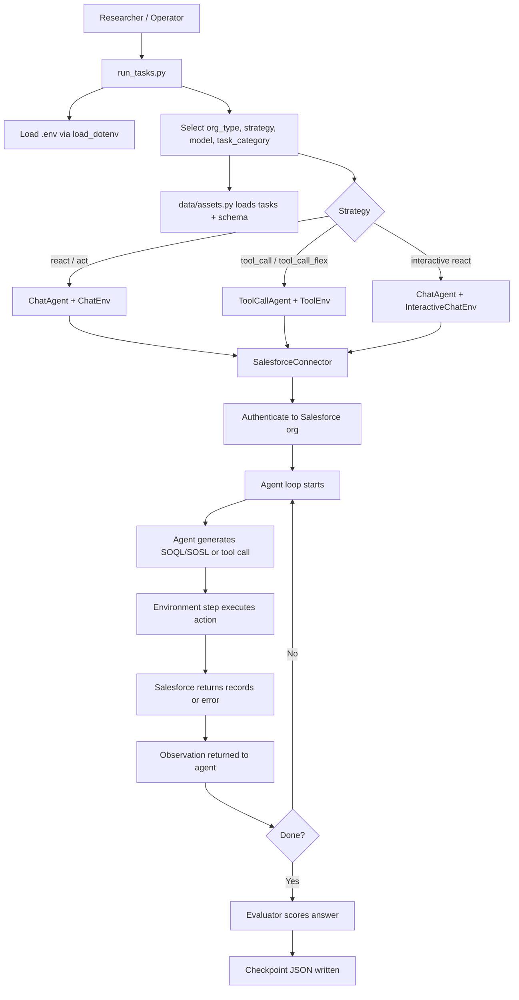
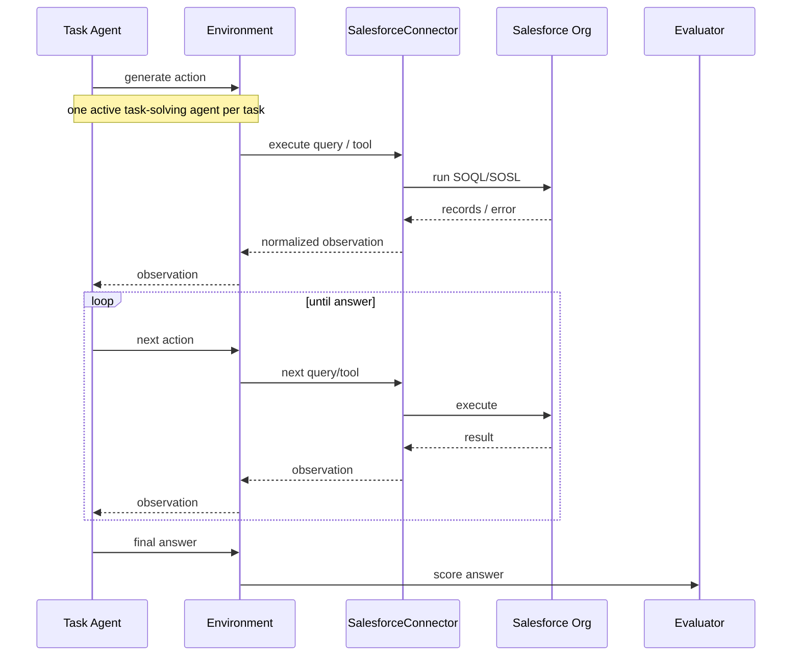
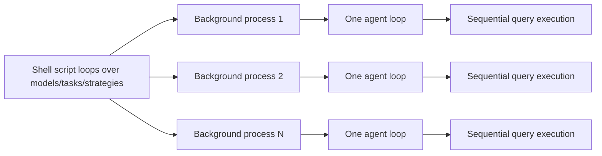

# 02 — Visual Flow (Mermaid)

## End-to-end evaluation flow



## Highlighted action-observation loop



## Parallelism model



## GUI/API access subflow

```mermaid
flowchart TD
    A[Researcher wants org access] --> B{Access mode}
    B -->|GUI| C[Request GUI access by email]
    B -->|API| D[Copy .env.example to .env]
    D --> E[Set Salesforce credentials + model keys]
    E --> F[SalesforceConnector.sf_auth(org_type)]
    F --> G[simple_salesforce.Salesforce(...)]
    G --> H[Authenticated session for evaluation runtime]
```
